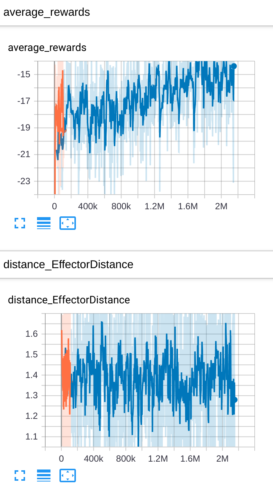
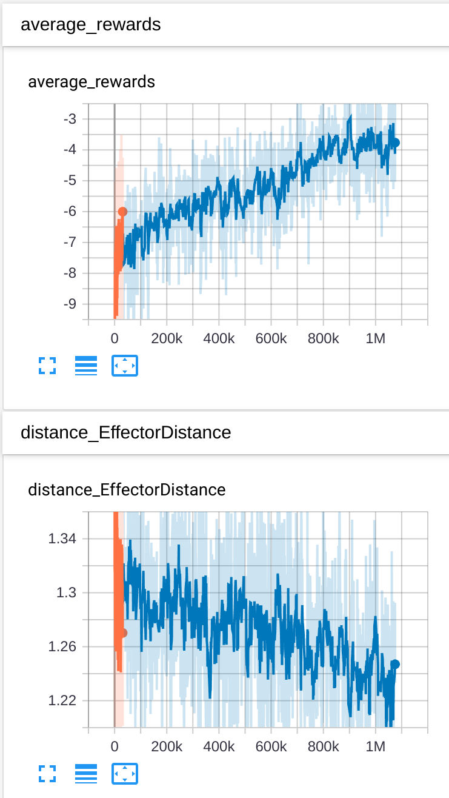

# IR-multi-sim
A Framework for robot simulation on multiple engines.

# Installation
Depending on the chosen target environments, different means of installation must be used.

## Isaac Sim
Follow the instructions found [here](https://docs.omniverse.nvidia.com/app_isaacsim/app_isaacsim/install_workstation.html) to install Isaac Sim.
Run any python files with Isaacs own python interpreter, usually located at "~/.local/share/ov/package/isaac_sim-*/python.shell", where the * is a wildcard for the installed issac sim version.

## PyBullet
Install the pybullet_requirements.txt to use the PyBullet engine. You can test the setup by running the pybullet_example.py with your python interpreter.

# Usage
Define your environment with simple classes: Robot, Obstacle, Reward and Reset. The environment will automatically be created in the specified engine. Observation and Action space will be automatically parsed depending on the robots and obstacles spawned in the environment.

## Configutarion Files
All of MultiSims functionality can be accesssed with configuration files. When running the main.py file, simply specify any of the example configuration files at "./data/files", or create your own!

```shell
python main.py -f ./data/configs/example_min.yaml
```

## Observability
Robots, robot joints and obstacles can be marked as observable, meaning that their relative position, orientation and scale will be included in the observations of the machine learning model.

## Robots
Robots need to be defined in an [urdf fiile](http://wiki.ros.org/urdf). The file needs to be saved in the "./data/robots" directory.

Example:
``` python
from scripts.spawnables.robot import Robot

r1 = Robot("robots/ur5/urdf/ur5_with_gripper.urdf",  # relative path to urdf file from data directory
    position=np.array([0, 1, 2]),                    # x,y,z coordinates from environment origin
    orientation=np.array([1, 0, 0, 0]),              # orientation in quaternion
    observalbe_joints=["ee_link"]                    # mark end effector ling as observable
)
```

## Obstacles
Three types of obstacles are currently supported: Cubes, Speheres and Cylinders. Colour, collision, observability and more can be configured with the parameters of the obstacle.
per default, all obstacles are observable

Example:
``` python
from scripts.spawnables.obstacle import Cube

target_cube = Cube(
    position=np.array([0.4, 1, 2]),  # relative x,y,z coordinates from environment origin
    color=np.array([0, 1, 0]),       # color of cube, in RGB values.
    scale=[0.1, 0.8, 1.3],           # scale of cube
    name="TargetCube"                # name of cube, allowing it to be referenced by reward functions
)
```

## Rewards
Rewards are functions which evluate the current environment state, rating desirable states with a high value and undesirable states with a low value.

Example:
``` python
from scripts.rewards.distance import Distance

# create distance function using names of previously spawned objects
target_distance = Distance(
    obj1="TargetCube",              # Reference the target cube by name
    obj2="R1/ee_link",              # Reference the ee_link of R1 robot by name (must be observable)
    name="TargetDistance",          # Name of the distance, allowing it to be referenced by reset functions
    minimize=True                   # True if the distance is supposed to be minimized, otherwise false
)

# create distance function using the previously spawned object
target_distance = Distance(
    obj_1=target_cube,
    obj_2="R1/ee_link",
    name="TargetDistance",
    minimize=True
)
```

## Resets
Resets are functions which determine wether the environment needs to be reset. This included exceeded min or max values of a previously defined distance function, or an exceeded number of timesteps.

``` python
from scripts.resets.distance_reset import DistanceReset

distance_reset = DistanceReset(
    distance=target_distance,       # Refefence can also be passed as name ("TargetDistance")
    min=0.1,                        # If distance drops below 0.1: Reset environment
    max=1.5                         # If distance exceeds 1.5: Reset environment
)
```

## Full example
This full example demonstrated how to easily create an environment constructed from previously explained parameters.
The example configuration files can be found under "./data/configs".

# Supported Engines
- [IsaacSim](https://developer.nvidia.com/isaac-sim)
- [Pybullet](https://pybullet.org/wordpress/)

## Planned Support
- ?

# Existing models
## Reach configuration
Reach the target cube spawned randomly by appling force to the joints.



## Set target positions
Reach the target cube spawned randomly by setting joint position targets, and seeing if the predicted configuration reaches the target.

